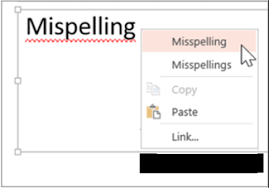

## “Do yuo fnid tihs smiple to raed?”

I recall looking on Instagram and seeing things like “Do yuo fnid tihs smiple to raed? Bceuase of the phaonmneal power of the human mnid, msot plepoe do.” It’s not difficult to read because the first and last letters are in their proper position and our brain automatically does the rest of the work for us, but it’s a bit of a headache isn’t it? Sure, we could probably read it in roughly the same time as a properly written passage if we really tried but even so, it’s just not something we want to look at. I’m constructing these sentences with certain rules so you (my amazing reader) can easily understand what I want to convey, while simultaneously having great readability without any annoyances.

## The Grammar of Good Code

How does this translate to code? Just like how the syntax of regular sentences abide by a certain set of rules, programming languages also have syntax that abide by coding standards. This is for the purpose of readability and understanding, which in turn, allow fellow software developers and contributors of your code to work more efficiently and grasp your thought process. Being consistent with the presentation of your code also reinforces your own understanding of your implementation, making learning a programming language not as demanding. Of course, being consistent is a lot easier said than done—we’re not robots that don’t make mistakes.

## The Red Squiggly Line

I’m sure we’ve all been there, creating an essay on Google documents or some sort of other word processor just to have a red squiggly line under a portion of your sentence. Even if it barely changes the structure of your beautifully written essay, it’s almost a sort of instinct that makes us fix the error right away. After all, having that red squiggly line under the word “suprised” because it should be spelled “surprised” feels as though the document editor is shaking its head. This occurs more often in a development environment than in a Google document and again, we aren’t robots that do everything exactly as expected. Luckily, while we may not be the ones who are robots, we have our friend, ESLint to help us with those issues. Instead of a Google document, ESLint is available on IntelliJ, notifying you whenever you make a not so pretty mistake. It may not be an error, but that red squiggly line will definitely tell you your inconsistencies that do not follow the coding standard.

## ESWin or ESLoss?

In my experience, I’ve only ever used one other Linter. With that Linter, you would have to run a command that would differ for every file to check for errors. After it tells you the list of hundreds of coding standard errors, you need to enter the file, fix the error manually, save and exit the file, then run the command again to see the list of hundreds of coding standard errors with 1 less error. One could imagine how painful this process truly was. So in comparison, I absolutely love ESLint. Not only because of the ease of use, but because it’s also effective with what it does. It teaches the user and enstills a mentality that your code is likely not just for you, but will also be seen and collaborated with by other people. The satisfaction of getting that green checkmark on the top right corner of your screen is amazing and feels like the learning process is truly working. Overall, ESLint is an incredibly useful tool that enforces the coding standard, ultimately creating both functional and readable code.
