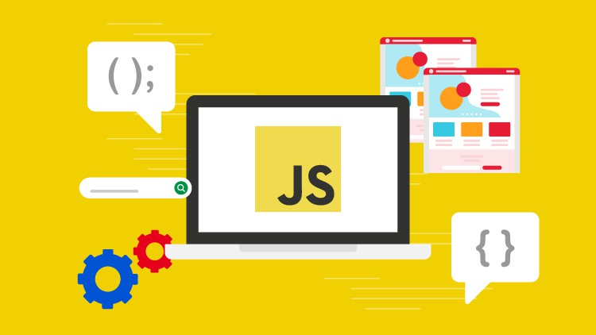
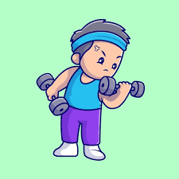

## A Blast to the Past

I remember sitting in a classroom during my first day of freshman year of high school, clicking my pen to the rhythm of a trending song I heard on the radio, mindlessly staring at my Chromebook screen. Like many other freshmen, I didn’t know what I wanted to do. I didn’t have a great amount of goals and really focused on appreciating the “now.” It was honestly a really scary thought that, at the time, we were just 4 years away from being adults and here I am sitting in my chair with an obscure idea of becoming a doctor all because I decided to put that on my “Future Goals” worksheet in elementary school. Fortunately for me, the very same class I was sitting in was also the only technology course in the entirety of the school, and throughout the 4 years I created very fond memories and clear goals to pursue. It all started with learning HTML, CSS, Python, then finally JavaScript.

## Personal thoughts on JavaScript

As someone revisiting JavaScript without consistent practice in the past few years, it was pretty enjoyable relearning the language. I have fairly clear memories of struggling with JavaScript as a freshman and with my current knowledge of coding from university, it was not only nostalgic but interesting thinking of those struggles when understanding them easily now. Perhaps it’s because of my fundamental understanding of coding and exposure to other languages now, but it was a recurring thought when I was going through the FreeCodeCamp. 

Although it has been less than a week since I relearned the language, I do believe it’s a powerful and relatively simple programming language. The ease of use of JavaScript is incredible and makes it a very versatile language and, in my opinion, is much easier than the other languages I’ve learnt in college, namely Java, C, and C++. I recently learned what it meant to be first-class (how functions can be treated as variables) and certain concepts such as arrow functions, granted I was never introduced to the ES6 version of JavaScript so everything from ES6 is completely new to me. Even if I can still learn much more about JavaScript, I do believe that overall JavaScript is great from a software engineering perspective.

## WOD! WOD! WOD!

Do you remember in P.E. when you were told to run a mile, or to hold that plank for a minute? Wasn’t it a bit fascinating that even though you were working out, time went by extraordinarily slowly? Well WODs (Workouts of the Day) are assessments,that are either pass or fail, that workout your brain with time that goes by extremely quickly. WODs are the core of the athletic software engineering style of learning, that assesses your ability to properly code using JavaScript, understanding problems and approaches, while under a time crunch. 

It may only be the second week of ICS 314, and I have only one practice WOD under my belt, but I think it is really effective and enjoyable. I feel as though I was able to code at my best despite my first “submission” that would likely not result in a passing grade due to careless errors, but even then, that was a learning experience for me. Regardless, I think it’s still a great way to reinforce solid coding. The stopwatch on the large screen adds to the pressure, but is a strong factor that pushes me to perform better on the WODs. It is stressful, but satisfying when you realize you solved the problem perfectly. 

For my personal learning style, I notice that I learn best when I am able to repeat assessments over and over or when I am able to take my time when approaching a problem. While this may not directly align with the athletic software engineering style of learning, there are still improvements on how I code with the WODs and being comfortable with doing timed exercises is a must with consideration to company technical interviews.
