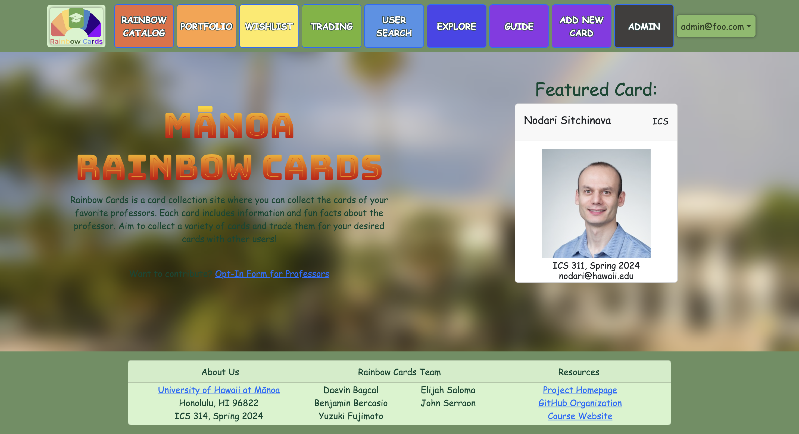
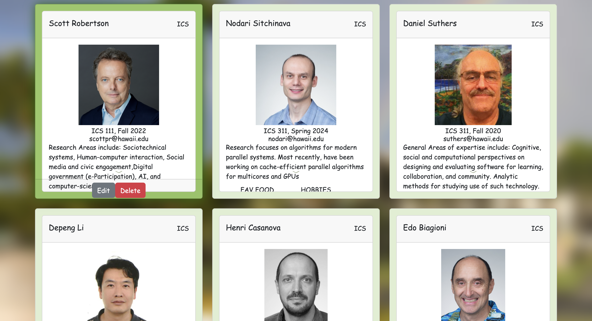

## General Overview

Manoa Rainbow Cards is a website that was designed to increase engagement in the classroom, by creating collectable trading cards of professors where one can learn their fun facts and interests. This includes details you would expect, such as the department or classes they teach, but also includes details such as hobbies, talents, and even their favorite food on campus. A professor’s trading card also provides their email to easily reach out to them. 


## The Experience

For this project, I was solely responsible for the entire testing process, via TestCafe, an end-to-end testing framework. Put simply, end-to-end testing is a testing technique where a software application and its functionality is assessed through a simulation that runs through the actual software application using its own input. This is meant to simulate live data and input from a user, showing an actual user’s experience. TestCafe allows me to check test cases and functionality without having to test it manually by hand and without a need to reset databases. Below is a snippet of a test case being assessed:

```cpp
test('Test that addprofessorcard page works for admin accounts', async (testController) => {
 await navBar.gotoSignInPage(testController);
 await signinPage.signin(testController, admin.username, admin.password);
 await navBar.isLoggedIn(testController, admin.username);
 await navBar.gotoAddPage(testController);
 await addPage.isDisplayed(testController);
 await addPage.add(
   testController,
   prof.name,
   prof.course,
   prof.semester,
   prof.department,
   prof.email,
   prof.image,
   prof.facts,
   prof.owner,
   prof.campus_eats,
   prof.hidden_talent,
 );
 await navBar.gotoCatalogPage(testController);
 await catalogPage.isDisplayed(testController);
 await catalogPage.hasAdded(testController);
});
```

Using the testController (the simulated cursor of a browser), I was able to simulate intended clicks on the Manoa Rainbow Cards website on certain buttons, text fields, and trading cards, for every page on our website. Designing and using functions from certain pages, one can replicate an entire user experience.

For example, using the signin function from the signinPage, the simulated cursor can click on the sign in button on the home page, fill out each text field with an admin’s login information, and successfully use their permissions. All of the navBar function’s were used by the simulated cursor to navigate through the website’s various pages, such as the addPage. Similarly to the signin function, the addPage’s add function allows the admin to add an entirely new card to the collection/catalog by filling out numerous textfields and clicking a submit button. Afterwards, checking if the newly added card actually appears in the catalogPage. Altogether, this is only one test case meant to simulate live user experience, testing whether or not the page that adds professor cards functions as intended. 

Aside from testing, I was also responsible for both general front-end and back-end development. For the front-end, a fair amount of my commits were dedicated toward aesthetic choices. This includes the background, header, footer, and style consistency between all pages. For the back-end, I created default data of our professors (as we can’t trade cards without the cards), and designed a delete function for admins that decide to remove a professor’s collectible card from the catalog.



## Takeaways

Having worked with a team on a web development project before, the communication and team-based project skills that I have already developed shown to be effective in our collaboration on Manoa Rainbow Cards. Prior to this project, I had no experience with end-to-end testing, but now I have developed strong fundamentals via TestCafe. Naturally, as all group members have had experience in web design, working on the front end with my team members was a smooth and educational experience. We did have some time constraints but we still pulled through via our consistent and reliable communication. Overall, the experience I had was incredibly educational, and although it may have been difficult at times, I look forward to development projects with even larger teams.

This is where you could find more information on the [Manoa Rainbow Cards Project.](https://rainbow-cards.github.io/).
