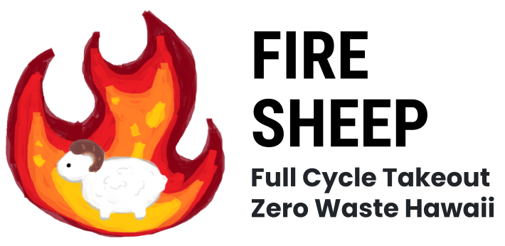
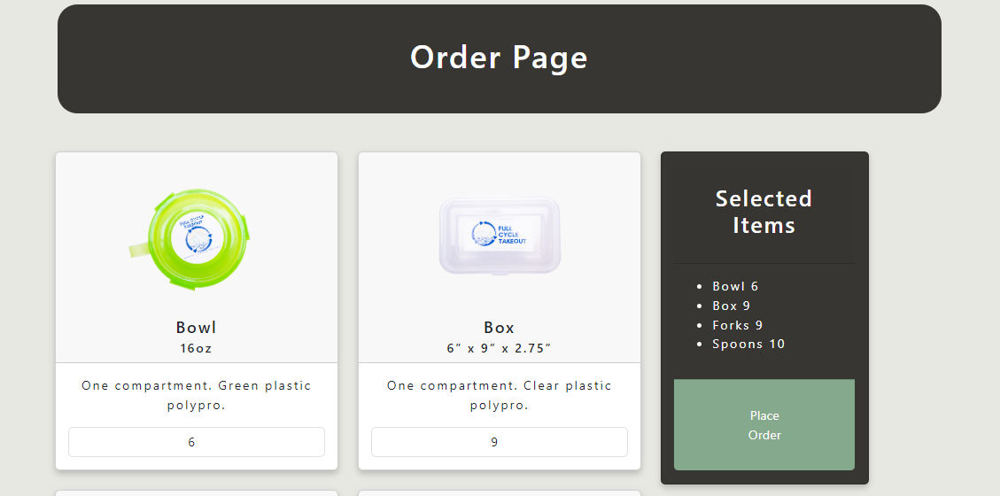
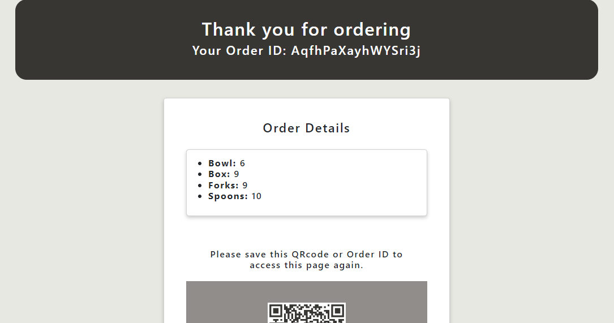
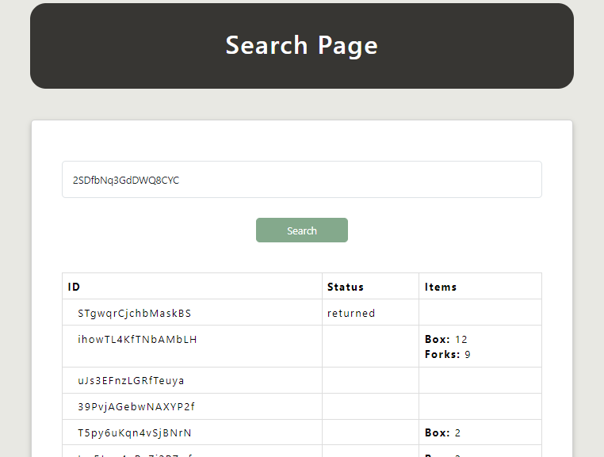
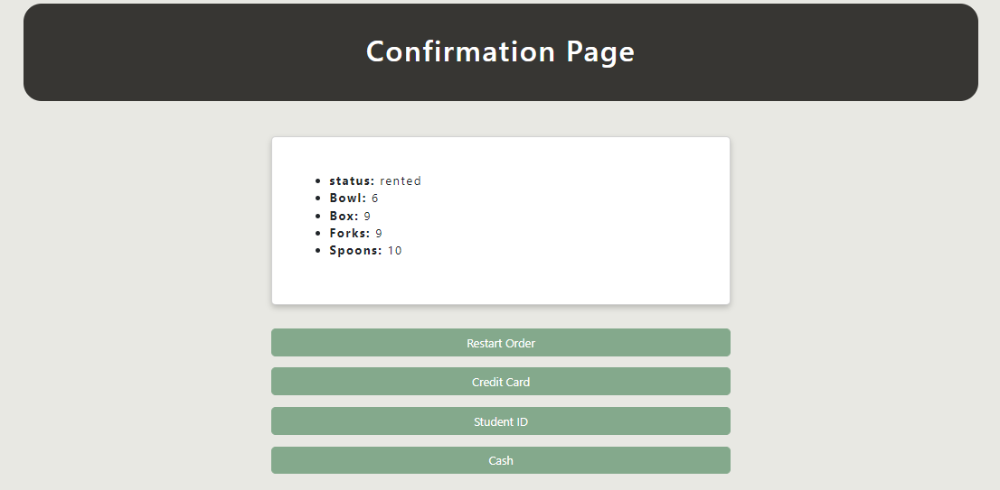
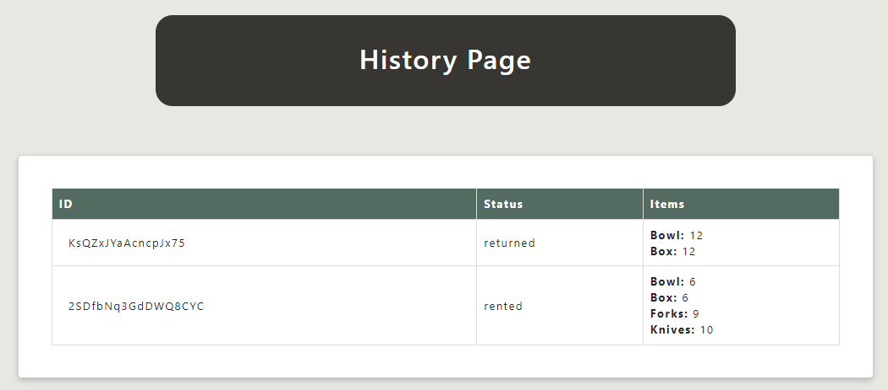

  

The Hawaii Annual Code Challenge (HACC) is an annually held event that challenges professional, amateurs, and students to create solutions for local organizations and the community of Hawaii. In 2023, FireSheep created a web application that kept track of reusable plastic containers that were borrowed by the local community to prevent excess waste from being created. There was a QR code and ID scanner to keep track of these reusable plastic containers, along with a user interface to easily select your preferences.

  
  

For this project, I was responsible for front-end development. As this was an application that allowed you to navigate multiple pages, I was tasked to make the user interface easily usable and to take into account how the user interface may function on your phone as opposed to a screen on a monitor. There were other people working on front-end development with me, so I had to also check their formatting and code, along with facilitating each of our tasks.

  
  
  

This is the associated page on [github](https://github.com/HACC2023/firesheep).
